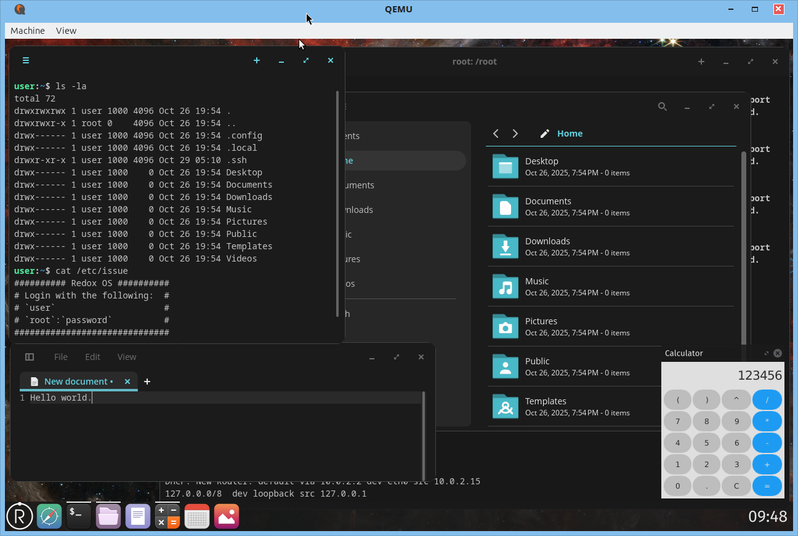
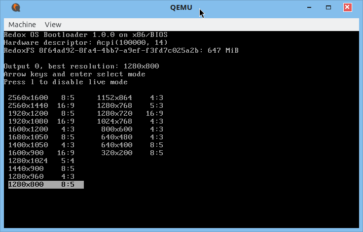

# Redox installer on QEMU

## What is this

This repository contains scripts to install
Redox OS into QEMU x86_64 emulator.
And scripts to boot Redox OS from Virtual Hard
Disk.

* Install Redox OS desktop to Virtual Hard Disk
  * Manually download ISO image
  * Create new SATA Virtual Hard Disk Drive
* Boot Redox OS demo / desktop GUI
  * 4 CPU cores
    * Limit to Host machine CPU cores
  * 4096 Mibytes main memory
  * Serilal port console duplexed QEMU monitor and
    Redox OS serial port
  * SATA connected Hard Disk Drive
    * Boot from CSM (Compatibility Support Module)
    * Persistent root "/" volume
  * PS/2 keyboard
    * Fixed US layout
  * PS/2 mouse
  * GUI enabled
  * NAT connected network
  * HDA audio
  * XHCI USB
    * Detects USB memory
      * dd command can read blocks
      * May fail writing, can't install Redox OS to
        virtual USB memory



## Required packages

On Ubuntu or delivered distributions,
install `curl`, `zstd`, `qemu-system-x86`,
and `qemu-utils` packages.

```bash
# Install packages.
sudo apt install curl zstd qemu-system-x86 qemu-utils
```

## Install

Scripts "start-redox*.sh" in this repository
help steps in [Redox document: Running Redox in a Virtual Machine](https://doc.redox-os.org/book/running-vm.html#running-redox-in-a-virtual-machine).

Using scripts "start-redox*.sh", install steps
are done as follows,

* (by hand) Download [Redox ISO images](https://static.redox-os.org/img/x86_64/)
  * Daily build Demo or Desktop ISO image 
* Installer script [start-redox-install.sh](./start-redox-install.sh) does,
  * Decompress .iso.zst image
  * Create new Virtual Storage to install
  * Boot Redox ISO image on QEMU
* (by hand) Install Redox OS into Virtual Storage
  * `sudo redox_installer_tui`
  * `sudo shutdown`
* Start scrpit [start-redox.sh](./start-redox.sh) does,
  * Boot Redox OS from Virtual Storage which contains Redox OS

### Download

Create or change directory to _base_directory_
to clone scripts from
[this repository](https://github.com/Akinori-Furuta/qemu-redox.git).

```bash
# As you needed, create base_directory to clone.
mkdir -p base_directory
# Change directory.
cd base_directory
# Clone this repository.
git clone https://github.com/Akinori-Furuta/qemu-redox.git
# Change directory into cloned directory.
cd qemu-redox
```

Download latest Redox OS .iso.zst image from
[Redox ISO images](https://static.redox-os.org/img/x86_64/) to _base_directory_/qemu-redox.
Visit the [Redox ISO images](https://static.redox-os.org/img/x86_64/) page and find latest .iso.zst image redox\_{desktop|demo}\_x86\_64\__yyyy_-_mm_-_dd_\__build_\_redox-live.iso.zst.
Where _yyyy_, _mm_, _dd_, and _build_ are latest date and build numbers.

If you will use `curl`, see following example.

```bash
# Continue from previous type in commands,
# Download .iso.zst image.
curl -O https://static.redox-os.org/img/x86_64/redox_desktop_x86_64_yyyy-mm-dd_build_redox-live.iso.zst
```

> [!TIP]
> Which is better choice Desktop or Demo?
>
> The Desktop is better. Less size and complexity
> make less trouble.
> The Demo includes games, Vim text editor,
> and htop process monitor. You can install
> these additional packages later by
> `sudo pkg install pacakge_name`.
> You can find Redox OS packages at
> [Redox OS packages/x86_64-unknown-redox](https://static.redox-os.org/pkg/x86_64-unknown-redox/).  

### Install to Virtual Hard Disk Drive

Run `./start-redox-install.sh` script. This script
decompresses .iso.zst image, creates new Virtual
Storage to install Redox OS, and start QEMU emulator.

```bash
# Continue from previous type in commands,
# Run Redox OS installer.
./start-redox-install.sh
```

You will see QEMU emulator window, choose
suitable (not larger than host PC desktop) screen
resolution by **\[↑\]\[↓\]\[←\]\[→\]** and **\[enter\]** keys.



Continue type in from host PC terminal where running
`./start-redox-install.sh`.
Some QEMU debugging and Redox OS logs are seen.
If you can't see `redox login:` prompt,
press **\[Enter\]** key.
Login as `user` (without password).

```text
redox login: user
```

At shell prompt `user:~$`. Type in Redox OS installer
command as follows. There is no password,
simply **\[Enter\]** at password prompt.

```text
sudo redox_installer_tui
[sudo] password for user:
```

Choose `7.4 GiB` drive, it may be seen drive number `1`,
simply **\[Enter\]** at redoxfs password prompt.

```text
1: /scheme/disk.pci-00-00-1f.2_ahci/0: 7.4 GiB
2: /scheme/disk.pci-00-00-1f.2_ahci/1: 650.0 MiB
Select a drive from 1 to 2: 1
installer_tui: redoxfs password (empty for none):
```

> [!TIP]
> You can configure size of drive (storage) capacity to
> install Redox OS. Edit `RedoxStorageSize="7530M"` parameter
> in [start-redox.conf](./start-redox.conf) file.
> If there is `redox-storage.qcow2` file, rename it.
> (for example:
> `mv redox-storage.qcow2 redox-storage-$(date +%s).qcow2`).

Shutdown Redox OS.

```text
sudo shutdown
[sudo] password for user:
```

It may takes 10 to 30 seconds terminating QEMU.

## Boot

### Boot from Virtual Storage

Boot from Virtual Storage. Use `start-redox.sh` script. It boots from `redox-storage.qcow2`.

```bash
# Continue from previous type in commands,
# Boot Redox OS from Virtual Storage.
./start-redox.sh
```

Any changes are kept in Virtual Storage.
When you see hangup or lose control Redox OS, try one of following action.

* QEMU menu Machine / Quit
* QEMU shot cut **\[Ctrl\]-\[Alt\]-\[Q\]**
* Type **\[Ctrl\]-\[a\] \[x\]** from terminal
  where running `./start-redox.sh`.

> [!TIP]
> Watch QEMU CPU resource usage which running Redox OS.
> It consumes very high CPU time near 100% or more.
> I noticed CPU usage issue when enabling `sshd` service
> on Redox OS.

## How about VirtualBox

VirtualBox can't run Redox OS well. You may see
following issues,

* PS/2 mouse doesn't work well
  * To enable mouse control
    * Select Virtual Machine Settings
       System / Motherboard / Pointing Device = PS/2 Mouse
    * Clear Check Virtual Machine Window Menu
       Input / Mouse Integration
      * So mouse cursor doesn't track inside
        VirtualBox window and Window Server screen
* IDE/SATA controller and drive don't work well
  * They cause "I/O error" (system call returns EIO)
    or "Check Sum error", may be timing issue
* Hangup suddenly

## How about real machine

May real machine couldn't boot Redox OS, useless.

* Very slow boot
  * On some PCs, read image from USB memory
    or Optical disc media drive drive
    at 1 to 3 Mbytes/sec or less speed.
    So, 5 or more minutes to complete boot.
    And you may see hang up or some error during
    long boot process.
* Need PS/2 keyboard and PS/2 mouse
  * We can find them on very old PC,
    but old PC can't boot Redox OS some other
    reasons (memory, CPU, or supported booting
    devices).
  * I can't found USB HID devices work with Redox OS.
* IDE/SATA controller and drive don't work well
  * I guess there is control timing issue.
    Redox OS driver accesses I/O ports and memory
    mapped registers out of timing specs. They hang.
    The driver can't detect drive.
* Only supports ISA bus connected IDE controller
  * Redox OS doesn't support PCI bus connected IDE
    controller. Could we found an ISA bus connected
    IDE controller?
